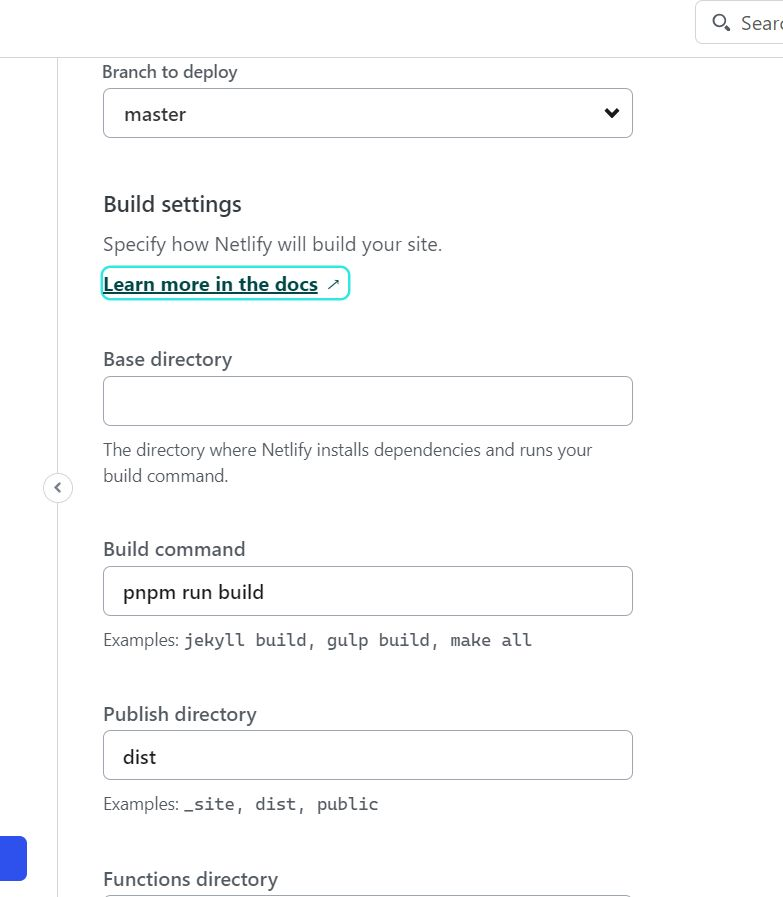

# React + Vite project example

## Topics

- simple one-page project
- using sass/scss
- animations with Framer-Motion
- react intersection observer
  ### Deploying on Netlify
- build:
    > pnpm run build
- deploy manualy: drag-and-drop dist folder
- deploy from GitHub repo:
  

Demo: [Portfolio](https://thunderous-stroopwafel-21f0b5.netlify.app/)